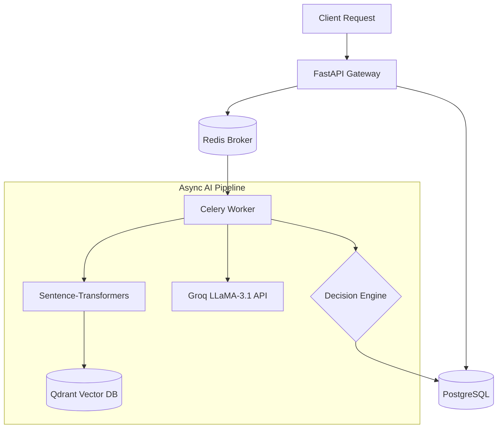

# LoanSphere_
AI-powered Smart Loan Application Processing System 🚀


A production-grade, asynchronous backend architecture designed for automated, intelligent loan risk assessment. Built with **FastAPI**, **Celery**, and **PostgreSQL**, this system implements a Retrieval-Augmented Generation (RAG) pipeline powered by the **LLaMA-3.1** model (via Groq API) to evaluate applicant financial data against historical vectors and configured risk thresholds.

---

## 🎯 Key Features

- **Microservice Architecture:** Strict boundaries separating the high-concurrency API gateway from heavy Machine Learning background workers.
- **Asynchronous Task Queue:** Uses Celery and Redis to offload time-consuming AI inference loops and vector database operations.
- **RAG AI Pipeline:** Converts financial profiles into 384-dimensional semantic vectors using `sentence-transformers` and searches Qdrant to provide the LLM with contextual historical precedent.
- **Graceful Degradation:** Safely falls back to a deterministic, rule-based decision engine (DTI, Credit Score, LTI algorithms) if the LLM provider fails or rate-limits.
- **Fully Dockerized:** Effortless container orchestration providing instant local environments including PostgreSQL, Redis, Qdrant, the API, and Celery Workers.

## 🏗️ System Architecture



---

## 🚀 Quick Start (Local Setup)

### 1. Prerequisites
- [Docker](https://www.docker.com/products/docker-desktop/) and Docker Compose installed.
- A free API key from [Groq Console](https://console.groq.com/).

### 2. Installation & Configuration

Clone the repository and set up your environment variables:
```bash
git clone https://github.com/yourusername/loan-system.git
cd loan-system
cp .env.example .env
```

Open `.env` and configure your API key:
```env
GROQ_API_KEY=gsk_your_real_api_key_here
GROQ_MODEL=llama-3.1-8b-instant
SECRET_KEY=super_secret_jwt_key
```

### 3. Build & Run the Infrastructure

Spin up the entire architecture (PostgreSQL, Redis, Qdrant, API, Celery):
```bash
docker compose up -d --build
```

### 4. Database Setup

Apply Alembic migrations to construct the relational tables in PostgreSQL:
```bash
docker compose exec api alembic upgrade head
```

*(Optional) Populate the database with test user accounts:*
```bash
docker compose exec api python scripts/seed.py
```

---

## 💻 Usage

Once running, access the interactive API documentation (Swagger UI):
👉 **[http://localhost:8000/docs](http://localhost:8000/docs)**

1. Click **Authorize** and login using the seeded credentials (`test@example.com` / `view123`).
2. Submit a `POST` request to `/applications/` with a sample payload:
```json
{
  "applicant_name": "Jane Doe",
  "annual_income": 95000,
  "credit_score": 750,
  "loan_amount": 25000,
  "employment_status": "Employed Full Time",
  "monthly_debts": 1200,
  "purpose": "Home Renovation",
  "notes": "Planning roof repairs."
}
```
3. Watch the background worker process the AI decision by running:
```bash
docker compose logs -f worker
```

---

## 👨‍💻 Host & Author

**Akash Gunge**
- Email: [gungeakash11@gmail.com](mailto:gungeakash11@gmail.com)
- GitHub: [@gungeakash11](https://github.com/gungeakash11)
- LinkedIn: [Akash Gunge](https://www.linkedin.com/in/akash-gunge-78b3b6228/)

If you found this project helpful or have any questions about the architecture, feel free to reach out or drop a ⭐ on the repository!


